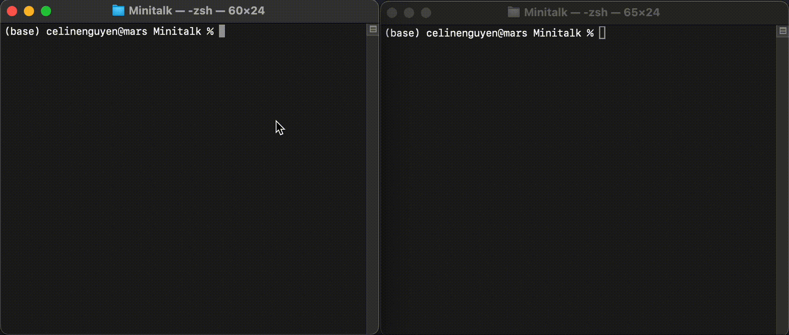

<div align="center">
  <!-- Logo -->
  <a href="https://github.com/celinenguyentu/Minitalk">
  
  </a>
</div>

# Minitalk

The purpose of this project is to code a small data exchange program using UNIX signals.

Grade : 125/100 \
Subjects v.3 : [`FR`](docs/minitalk_v3.fr.pdf) [`EN`](docs/minitalk_v3.en.pdf) \
42 Norm v.4 : [`FR`](docs/norm_v4.fr.pdf) [`EN`](docs/norm_v4.en.pdf)

## Content

The project contains two programs `server` and `client`.
* At launch, `server` prints its PID and waits for incoming messsages.
* The `client` takes to arguments : the `server` PID and the string to send. 

Communication between the two is done only using UNIX signals `SIGUSR1` and `SIGUSR2`. Once the server has received the entire message, it prints it and wait for new incoming messages.

To achieve this project, one must know how to use signals in a secure manner, to handle interference from external signals and ensure the integrity of the message under all circumstances. Optimization is essential to achieve quick communication between the programs. The communication itself uses binary encryption with an approach compatible with Unicode encoding.

## Usage

Git clone with :
```bash
git clone https://github.com/celinenguyentu/Minitalk && cd Minitalk
```

### Requirements

This project is written in C language and need either gcc or clang compiler, with `<signal.h>`, `<stdlib.h>`, `<stdarg.h>` and `<unistd.h>` standard libraries to run.

### Compilation

* `make`or `make all` - compile binaries `server` and `client`
* `make bonus` - compile binaries `server` and `client` (bonus version)
* `make fclean` - remove all object files and binaries

### Launch programs

After compiling the binary files, open two shell windows and launch the `server` first :
```bash
./server
```
In the other window, launch a `client` with the message to send :
```bash
./client <server PID> <message>
```
In the bonus version, any client is able to quit the `server` by sending the message `exit`.

### Example



## Testers

Those are third-party tester to run complementary tests, use them at your own risk :
- @ThibaudM13 [minitalk-Tester](https://github.com/ThibaudM13/minitalk-Tester)
- @xicodomingues [francinette](https://github.com/xicodomingues/francinette)